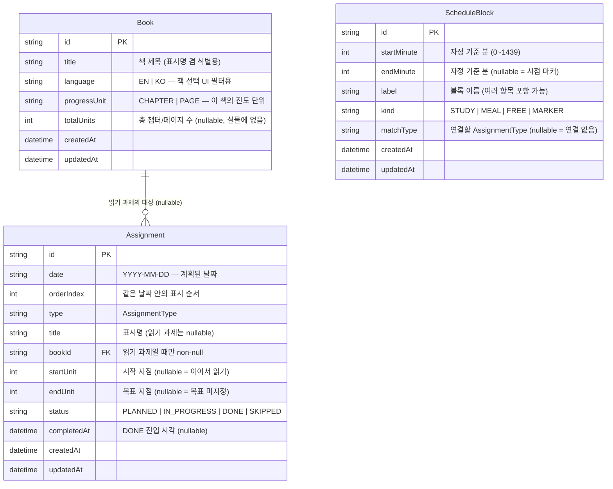
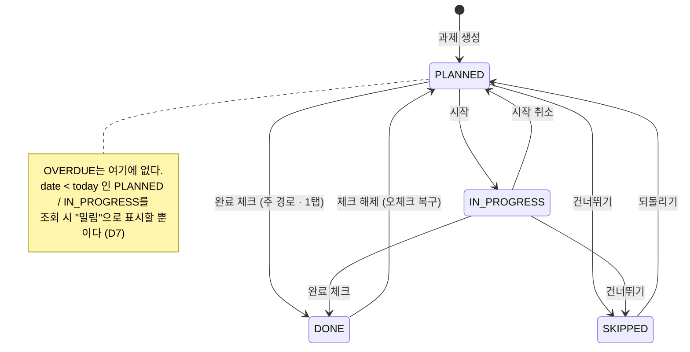

# r-hw 아키텍처 설계

> **이 문서의 독자는 구현 에이전트(Codex)다.**
> Codex는 이 문서와 여기서 파생된 `docs/specs/T##-*.md`만 보고 구현한다.
> 이 문서는 **무엇을 만드는가**를 모호함 없이 서술한다.
> **왜 그렇게 정했고 무엇을 기각했는가**는 [`decisions.md`](./decisions.md)에 있다 — 본문의 `(D5)` 표기는 그 문서의 항목을 가리킨다.
> 판단이 필요한 지점에서 두 문서 어디에도 답이 없다면, 그것은 설계 누락이다 — 임의로 진행하지 말고 질문할 것.

- 상태: **승인됨** (2026-07-31)
- 스택(고정): Next.js App Router + TypeScript + Prisma + SQLite / vitest(단위) + Playwright(E2E)
- 근거 자료: `docs/mockups/plan-20days.jpg`, `docs/mockups/daily-schedule.jpg`
- 함께 볼 것: [`decisions.md`](./decisions.md) — 설계 결정 18건의 근거와 기각한 대안

---

## 0. 실물 자료에서 읽어낸 사실

설계 판단의 근거이므로 먼저 기록한다. **추측이 아니라 사진에서 직접 관찰된 내용만** 적었다.

### 0.1 `plan-20days.jpg` — 날짜별 과제 계획표

5칸 × 4줄 = 20칸 그리드. 7/29 ~ 8/17.

| 날짜 | 내용 |
|---|---|
| 7/29 | Big Note ch.6 / 김치찌… / 일기 |
| 30 | Big Note ch.12 / work sheet |
| 31 | 엄마 5분만 / 무지개 물고기 |
| 8/1 | Kid Spy ch.10 / 일기 / 김방구 3 |
| 2 | Kid Spy ch.16 / work sheet |
| 3 | *(빈칸, `-` 표시만)* |
| 4 | 13 Tree House ch.7 / 일기 |
| 5 | 13 Tree House ch.13 / work sheet |
| 6 | Andrew Lost / work sheet |
| 7 | 일기 |
| 8 | wimpy kid ~p.102 / 일기 |
| 9 | wimpy kid ~p.217 / work sheet |
| 10 | *(빈칸)* |
| 11 | Jake Drake Bully Buster / 일기 |
| 12 | Jake Drake Bully Buster / reading project |
| 13 | reading project |
| 14~17 | *(빈칸)* |

관찰 사실과 그 함의:

| # | 관찰 | 설계 함의 |
|---|---|---|
| F1 | 같은 책이 연속/근접한 날짜에 반복 등장하고 숫자가 증가한다 (Big Note ch.6 → ch.12, Kid Spy ch.10 → ch.16, wimpy kid ~p.102 → ~p.217) | 진도의 "시작점"은 **같은 책의 직전 계획**에서만 도출된다. 날짜순 직전 과제가 아니다 → 책이 1급 엔티티여야 한다 (**D4**) |
| F2 | 영어책과 한글책이 번갈아 등장한다 (Big Note ↔ 김치찌…, Kid Spy ↔ 김방구 3) | 진도 체인은 **책 단위로 스코프**되어야 한다. 날짜만으로 이어붙이면 다른 책의 챕터를 물려받는다 |
| F3 | 단위가 책마다 다르다: `ch.` (Big Note, Kid Spy, 13 Tree House) vs `p.` (wimpy kid) | 단위(chapter/page)는 **과제가 아니라 책**의 속성이다. 한 책 안에서 단위가 섞이지 않는다 (**D4**) |
| F4 | 진도 표기가 아예 없는 책도 있다 (Andrew Lost, Jake Drake Bully Buster, 엄마 5분만, 무지개 물고기) | 목표 지점(endUnit)은 **nullable**이어야 한다. "오늘은 이 책 읽기"만으로 유효한 과제다 |
| F5 | 시작점은 **어디에도 적혀 있지 않다**. `~p.102`처럼 끝 목표만 적힌다 | 시작점의 부재는 데이터 누락이 아니라 **도메인의 실제 상태**다 → NULL이 의미론적으로 정직한 표현 (**D5**) |
| F6 | 줄마다 펜 색이 다르다 (검정 → 분홍 → 주황 → 빨강) | 계획은 한 번에 다 쓰이지 않고 **5일치씩 점진적으로** 작성됐다. 즉 "지난번 다음"은 *읽은 실적*이 아니라 *직전 계획*을 의미한다 (**D6**) — 8/9를 쓰는 시점에 8/8은 아직 읽지 않았다 |
| F7 | 빈칸에도 `-` 불릿이 미리 그어져 있다 | 칸은 있으나 내용 미정인 상태. 데이터로는 "과제 0건"이지만, **UI는 "계획 없음"을 명시적으로 보여줘야** 한다 |
| F8 | 한 칸에 1~3개가 세로로 순서대로 적힌다 | 날짜 안의 **표시 순서**가 존재한다 → `orderIndex` 필요 |
| F9 | 그리드가 5칸 폭이다 (요일 정렬 아님) | 부모의 멘탈 모델은 "방학 20일"이지 "주"가 아니다. 다만 요구사항의 "이번 주 남은 것"은 주 단위 → 두 모델이 공존한다 (**§8**) |
| F10 | `reading project`가 8/12, 8/13 이틀에 걸쳐 있다 | 다일 과제는 **날짜별 독립 레코드 2건**으로 표현된다. 부모-자식 관계로 모델링할 근거는 사진에 없다 → 과도한 모델링 회피 |

### 0.2 `daily-schedule.jpg` — 매일 반복되는 시간표

```
7:30            기상
8:00            아침식사 끝내기
8:00 ~ 10:00    원리셈 · 플라토 · 따플 · 디딤돌
10:00 ~ 11:00   영어책 읽기
11:00 ~ 11:30   일기쓰기
11:30 ~ 12:30   점심 & 자유시간
12:30 ~ 12:45   뿌리깊은 국어
12:45 ~ 2:00    영어책 읽기
2:00 ~ 3:00     한글책 읽기
3:00 ~ 5:00     영어숙제 끝내기
```

| # | 관찰 | 설계 함의 |
|---|---|---|
| F11 | `7:30 기상`, `8:00 아침식사 끝내기`는 **범위가 아니라 시점**이다. 나머지는 범위다 | `endMinute`을 nullable로 두어 시점 마커를 표현 (**D10**) |
| F12 | `2:00`, `3:00`, `5:00`은 명백히 오후다 (12:45 다음에 2:00이 온다) | 저장은 24시간 기준으로 정규화해야 한다. 문자열 그대로 저장하면 정렬이 깨진다 (**D10**) |
| F13 | `8:00~10:00` 한 블록에 항목이 4개(원리셈/플라토/따플/디딤돌) 들어 있다 | 블록 라벨은 **여러 항목을 담는 자유 텍스트**다. 항목별 체크 요구는 사진에 없다 (**D11-b**) |
| F14 | `영어책 읽기`가 두 블록(10:00~11:00, 12:45~2:00)에 **중복 등장**한다 | 블록 ↔ 과제는 **1:1이 아니다**. 같은 과제가 여러 블록에 걸린다 (**D11**) |
| F15 | 수학(원리셈/플라토/따플/디딤돌)과 뿌리깊은 국어는 **시간표에만 있고 계획표에는 없다** | 모든 시간 블록이 과제와 연결되지는 않는다. 순수 루틴 블록이 존재한다 → 연결은 **optional** |
| F16 | `점심 & 자유시간`처럼 숙제가 아닌 블록도 있다 | 위와 동일. 블록의 성격 구분이 필요 |
| F17 | `8:00 아침식사 끝내기`(시점)와 `8:00~10:00`(범위)이 같은 시각에 공존한다 | 겹침 검증은 **범위끼리만** 적용하고 시점 마커는 제외해야 한다 (**D15**) |
| F18 | 범위 블록끼리는 서로 겹치지 않는다 | 겹침 금지를 불변식으로 세울 수 있다 → "지금 뭐 할 시간?" 질의가 항상 단일 결과 (**D15**) |

### 0.3 두 자료의 관계

시간표의 블록은 **활동 카테고리**이고, 계획표의 항목은 그 카테고리의 **그날의 구체적 인스턴스**다.

```
시간표(매일 반복)                계획표(날짜별)
10:00~11:00 영어책 읽기  ←────  8/2: Kid Spy ch.16
11:00~11:30 일기쓰기     ←────  8/2: (일기 없음 — 8/1에 있음)
2:00~3:00   한글책 읽기  ←────  8/1: 김방구 3
8:00~10:00  원리셈 등     ←────  (대응 없음 — 순수 루틴)
```

이 대응 관계를 **저장할 것인가 파생할 것인가**가 D11의 쟁점이다.

---

## 1. 데이터 모델 (ERD)

### 1.1 개요



**`ScheduleBlock`과 `Assignment` 사이에 FK가 없다는 점에 주의.** 연결은 `matchType`을 통한 파생 관계다 → **D11** 참조.

### 1.2 Prisma 스키마 (설계 표기 — 이 문서 단계에서 파일로 만들지 않는다)

```prisma
// enum은 Prisma 6.2.0 이상에서만 SQLite에 쓸 수 있다 → D13 참조.
// package.json의 prisma / @prisma/client를 ^6.2.0 이상으로 고정할 것.

enum AssignmentType {
  ENGLISH_READING   // 영어책 읽기 — Big Note, Kid Spy, 13 Tree House, wimpy kid ...
  KOREAN_READING    // 한글책 읽기 — 김방구 3, 엄마 5분만, 무지개 물고기 ...
  WORKSHEET         // work sheet
  DIARY             // 일기
  PROJECT           // reading project
  ETC
}

enum AssignmentStatus {
  PLANNED
  IN_PROGRESS
  DONE
  SKIPPED
}

enum ProgressUnit  { CHAPTER  PAGE }
enum BookLanguage  { EN  KO }
enum BlockKind     { STUDY  MEAL  FREE  MARKER }

model Book {
  id           String       @id @default(cuid())
  title        String       @unique
  language     BookLanguage
  progressUnit ProgressUnit
  totalUnits   Int?
  archivedAt   DateTime?    // non-null = 보관됨. 책 선택 목록에서 숨김 (D17)
  assignments  Assignment[]
  createdAt    DateTime     @default(now())
  updatedAt    DateTime     @updatedAt
}

model Assignment {
  id          String           @id @default(cuid())
  date        String           // "YYYY-MM-DD" — D9 참조 (의도적으로 DateTime이 아님)
  orderIndex  Int              @default(0)
  type        AssignmentType
  title       String?
  bookId      String?
  book        Book?            @relation(fields: [bookId], references: [id])
  startUnit   Int?
  endUnit     Int?
  status      AssignmentStatus @default(PLANNED)
  completedAt DateTime?
  createdAt   DateTime         @default(now())
  updatedAt   DateTime         @updatedAt

  @@index([date, status])   // 오늘 목록 + 밀린 목록 둘 다 커버 (D7)
  @@index([bookId, date])   // 진도 체인 역추적 (D5)
}

model ScheduleBlock {
  id          String          @id @default(cuid())
  startMinute Int
  endMinute   Int?
  label       String
  kind        BlockKind       @default(STUDY)
  matchType   AssignmentType?
  createdAt   DateTime        @default(now())
  updatedAt   DateTime        @updatedAt

  @@index([startMinute])
}
```

### 1.3 필드별 의미 — 모호함 제거

#### `Book`

| 필드 | 의미 | 비고 |
|---|---|---|
| `title` | 책 제목. 사용자가 입력한 문자열 그대로. "김방구 3"처럼 권수가 붙어도 **파싱하지 않는다** | `@unique` — 같은 제목 재입력 시 find-or-create로 재사용해 진도 체인이 끊기지 않게 한다 (F1) |
| `language` | `"EN"` \| `"KO"`. **책 선택 UI의 필터 용도로만 쓴다.** 시간표 매칭에는 쓰지 않는다 | 매칭은 `Assignment.type`으로 한다 → D3 |
| `progressUnit` | `"CHAPTER"` \| `"PAGE"`. 이 책의 진도를 세는 단위 | 과제가 아니라 책에 둔다 (F3). 한 책 안에서 `ch.6 → p.217` 같은 혼용이 원천 차단된다 |
| `totalUnits` | 총 챕터/페이지 수. **nullable** | 실물에는 없는 정보다. 진행률 표시용 선택 항목이며, **없다고 해서 어떤 기능도 막히면 안 된다** |
| `archivedAt` | 보관 시각. non-null이면 **책 선택 목록에서 숨긴다.** 과제 표시·진도 체인에는 계속 참여한다 | D17. 다 읽은 책을 목록에서 치우되 지난 계획 기록은 보존하기 위한 필드 |

#### `Assignment`

| 필드 | 의미 | 비고 |
|---|---|---|
| `date` | 이 과제를 하기로 계획된 날짜. `"YYYY-MM-DD"` 문자열 | D9 참조. 마감일 개념과 동일하다 — 별도 `dueDate`를 두지 않는다 |
| `orderIndex` | 같은 `date` 안에서의 표시 순서. 0부터 | F8. 유니크 제약을 걸지 않는다 → D15-b |
| `type` | `AssignmentType` 중 하나 (§1.4) | |
| `title` | 표시명. **읽기 유형이면 nullable**(비면 책 제목 사용), 비읽기 유형이면 필수 | §1.5 불변식 참조 |
| `bookId` | 읽기 유형일 때 대상 책. **읽기 유형이면 필수, 아니면 반드시 null** | §1.5 불변식 |
| `startUnit` | 시작 지점. **NULL = "직전 계획에 이어서"**, 값 있음 = "명시적으로 지정됨" | D5 — 이 필드의 NULL은 "모름"이 아니라 **"이어서"라는 의미를 갖는다** |
| `endUnit` | 목표 지점 (`~p.102`의 102). **nullable** = 목표 미지정, 그냥 그 책 읽기 | F4 |
| `status` | 저장되는 4개 상태 중 하나 (§3). **`OVERDUE`는 여기 들어가지 않는다** | D7 |
| `completedAt` | `DONE`으로 전이한 시각. `DONE`을 벗어나면 `null`로 되돌린다 | "오늘 몇 개 했나" 집계용 |

#### `ScheduleBlock`

| 필드 | 의미 | 비고 |
|---|---|---|
| `startMinute` | 자정 기준 분. `13:00` → `780` | D10 |
| `endMinute` | 자정 기준 분. **NULL = 시점 마커**(기상, 아침식사 끝내기) | F11 |
| `label` | 블록 이름. `"원리셈 · 플라토 · 따플 · 디딤돌"`처럼 여러 항목이 한 문자열에 들어갈 수 있다 | F13 |
| `kind` | `"STUDY"` \| `"MEAL"` \| `"FREE"` \| `"MARKER"`. **표시 스타일 결정에만 쓴다.** 로직 분기에 쓰지 않는다 | `endMinute == null`이면 `kind`는 `MARKER`여야 한다 (§1.5) |
| `matchType` | 이 블록이 보여줄 `AssignmentType`. **NULL = 연결 없는 순수 루틴 블록** | F15, D11 |

### 1.4 열거값 정의 (단일 출처)

**Prisma 스키마(§1.2)가 유일한 정의처다** (D13). Prisma Client가 값과 타입을 생성하므로 값 목록을 손으로 다시 적지 않는다.

도메인 코드는 `src/domain/enums.ts`에서 **재수출만** 하여 import 경로를 하나로 유지한다. 여기에 손으로 쓴 값 배열을 두지 말 것 — Prisma 스키마와 갈라진다.

```ts
// src/domain/enums.ts — 정의가 아니라 재수출 + 도메인 헬퍼
export { AssignmentType, AssignmentStatus, ProgressUnit, BookLanguage, BlockKind }
  from '@prisma/client';
import { AssignmentType } from '@prisma/client';

/** 읽기 유형 판별. D3에서 영어/한글을 별도 type 값으로 나눈 대가를 여기 한 곳으로 모은다. */
export const READING_TYPES = [
  AssignmentType.ENGLISH_READING,
  AssignmentType.KOREAN_READING,
] as const;

export const isReadingType = (t: AssignmentType): boolean =>
  READING_TYPES.includes(t as (typeof READING_TYPES)[number]);
```

Zod 검증은 `z.nativeEnum(AssignmentType)`을 쓴다. 값 목록을 Zod에 다시 적지 않는다.

> **참고 — `@prisma/client` import에 대하여:** D14는 도메인 계층이 Prisma에 의존하지 않게 하라고 요구하지만, 그 규칙의 대상은 **`PrismaClient` 인스턴스와 I/O**다. 생성된 enum 값·타입을 import 하는 것은 DB 연결을 만들지 않으므로 허용된다. 도메인 함수가 `prisma.assignment.findMany()`를 부르는 것만 금지된다.

### 1.5 불변식 (Invariants) — 반드시 테스트로 고정할 것

Prisma enum 덕분에 **개별 필드의 값 범위는 DB/엔진이 강제한다** (D13). 그러나 아래는 **여러 컬럼에 걸친 조건**이라 Prisma 스키마로 표현할 수 없다. **애플리케이션 계층의 Zod discriminated union + vitest**로 강제한다. 각 항목마다 통과 케이스와 위반 케이스를 모두 작성한다.

| # | 불변식 | 위반 시 |
|---|---|---|
| I1 | `isReadingType(type)` ⟺ `bookId != null` | 400 |
| I2 | `!isReadingType(type)` ⟹ `startUnit == null && endUnit == null` | 400 |
| I3 | 비읽기 유형은 `title`이 공백 아닌 문자열 | 400 |
| I4 | `startUnit != null && endUnit != null` ⟹ `startUnit <= endUnit` | 400 |
| I5 | `startUnit`, `endUnit`은 `>= 1` | 400 |
| I6 | `date`는 유효한 `YYYY-MM-DD` (`2026-02-30` 같은 값 거부) | 400 |
| I7 | `0 <= startMinute <= 1439`, `endMinute`이 있으면 `startMinute < endMinute <= 1440` | 400 |
| I8 | `endMinute == null` ⟺ `kind == 'MARKER'` | 400 |
| I9 | 범위 블록끼리 시간 겹침 금지. 마커는 검증 대상 제외 | 409 |
| I10 | `completedAt != null` ⟺ `status == 'DONE'` | 서비스 계층이 자동 유지 (사용자 입력 아님) |
| I11 | `Book` **하드 삭제** 시 참조하는 `Assignment`가 있으면 거부. 참조가 0건이면 허용 (D17) | 409 + 참조 건수 |
| I12 | 보관된 책(`archivedAt != null`)은 **새 과제 생성 시 선택할 수 없다.** 기존 과제는 그대로 유효 | 400 |

---

## 2. 설계 결정

**결정의 근거와 기각한 대안은 [`decisions.md`](./decisions.md)에 있다.** 이 문서 전체에서 `(D5)` 같은 표기는 그 문서의 항목을 가리킨다.

두 문서를 나눈 이유: 이 문서는 **무엇을 만드는가**를, `decisions.md`는 **왜 그렇게 정했는가**를 답한다. 같은 내용을 양쪽에 두면 반드시 갈라지므로, 각 결정의 본문은 `decisions.md`에만 존재한다.

| # | 결정 | 이 문서에서 영향받는 곳 |
|---|---|---|
| [D1](./decisions.md#d1) | 날짜별 과제와 반복 시간표를 별도 엔티티로 분리 | §1.1 |
| [D2](./decisions.md#d2) | 과제 유형: 단일 테이블 + `type` 컬럼 | §1.2, §1.5 |
| [D3](./decisions.md#d3) | 영어책/한글책을 `type`의 별도 값으로 | §1.4, §5.4 |
| [D4](./decisions.md#d4) | `Book`을 별도 테이블로 | §1.3, §5.3 |
| [D5](./decisions.md#d5) | 진도 시작점: nullable `startUnit` (NULL = 이어서) | §1.3, **§4** |
| [D6](./decisions.md#d6) | 진도 체인은 계획 기반, 상태 무관 | §4.2 |
| [D7](./decisions.md#d7) | `OVERDUE`를 저장하지 않고 파생 계산 | §3.3, §3.4, §5.1 |
| [D8](./decisions.md#d8) | "오늘"은 고정 타임존(`Asia/Seoul`)으로 서버가 확정 | §3.4, §5.1, §6.3 |
| [D9](./decisions.md#d9) | `Assignment.date`는 `String("YYYY-MM-DD")` | §1.2, §1.3 |
| [D10](./decisions.md#d10) | 시간표 시각은 자정 기준 분(Int) | §1.3, §5.4 |
| [D11](./decisions.md#d11) | 블록↔과제는 `matchType` 파생 매칭 | §1.1, §5.4, §6.2-2 |
| [D12](./decisions.md#d12) | `SKIPPED` 종료 상태 도입 | §3.1, §3.2 |
| [D13](./decisions.md#d13) | Prisma `enum` 사용 (≥ 6.2.0) | §1.2, §1.4 |
| [D14](./decisions.md#d14) | 순수 도메인 계층 + 얇은 Route Handler | §5, §7.1 |
| [D15](./decisions.md#d15) | 범위 블록 겹침 금지, 시점 마커는 예외 | §1.5(I9), §6.2-2 |
| [D16](./decisions.md#d16) | 상시 열린 화면 전제: 폴링 · 날짜 전환 · 시각 동기화 | §5.4, §6.3, §6.4 |
| [D17](./decisions.md#d17) | 책 삭제를 보관/하드 삭제로 분리 | §1.3, §1.5(I11·I12), §5.3, §6.2-5 |
| [D18](./decisions.md#d18) | 방학 기간은 코드 상수 (2026-07-29 ~ 08-17) | §6.2-3 |

부수 결정 `D15-b`(`orderIndex`에 유니크 제약 없음)도 같은 문서에 있다.

---

## 3. 상태 전이

### 3.1 저장되는 상태와 파생되는 상태



### 3.2 전이 행렬 (이 표가 `canTransition()`의 명세다)

| from \ to | PLANNED | IN_PROGRESS | DONE | SKIPPED |
|---|---|---|---|---|
| **PLANNED** | – | ✅ | ✅ | ✅ |
| **IN_PROGRESS** | ✅ | – | ✅ | ✅ |
| **DONE** | ✅ | ❌ | – | ❌ |
| **SKIPPED** | ✅ | ❌ | ❌ | – |

허용하지 않는 전이의 이유:

- `DONE → IN_PROGRESS`: 의미가 없다. 되돌리려면 `PLANNED`를 거친다 (경로가 하나뿐이어야 UI가 단순하다).
- `DONE → SKIPPED`: 이미 한 일을 안 한 일로 만들 이유가 없다.
- `SKIPPED → DONE` / `SKIPPED → IN_PROGRESS`: 다시 하기로 했다면 먼저 `PLANNED`로 되돌린다.

**부수 효과 (서비스 계층이 자동 처리, 사용자 입력 아님 — I10):**
- `→ DONE`: `completedAt = now()`
- `DONE →` (이탈): `completedAt = null`

### 3.3 파생 표시 상태 (저장하지 않음)

```ts
export type DisplayStatus = AssignmentStatus | 'OVERDUE';

/** 순수 함수. today는 D8의 getToday()가 만든 값을 주입받는다. */
export function deriveDisplayStatus(
  a: { date: string; status: AssignmentStatus },
  today: string,
): DisplayStatus {
  if (a.status === 'DONE' || a.status === 'SKIPPED') return a.status;
  return a.date < today ? 'OVERDUE' : a.status;   // 문자열 비교로 충분 (D9)
}
```

**필수 테스트 케이스:**

| 입력 | 기대 |
|---|---|
| `date`=어제, `PLANNED` | `OVERDUE` |
| `date`=어제, `IN_PROGRESS` | `OVERDUE` |
| `date`=어제, `DONE` | `DONE` (밀림 아님) |
| `date`=어제, `SKIPPED` | `SKIPPED` (밀림 아님 — D12의 핵심) |
| `date`=오늘, `PLANNED` | `PLANNED` (**당일은 아직 밀린 것이 아니다**) |
| `date`=내일, `PLANNED` | `PLANNED` |

### 3.4 "남은 숙제" 버킷 정의 (요구사항의 핵심 — 정확한 정의)

`today`는 D8로 확정된 하나의 값이며, 아래 세 버킷은 **반드시 같은 `today`를 공유한다** (D7의 대가 완화).

| 버킷 | 정의 |
|---|---|
| **오늘 남은 것** | `date == today && status ∈ {PLANNED, IN_PROGRESS}` |
| **밀린 것** | `date < today && status ∈ {PLANNED, IN_PROGRESS}` |
| **이번 주 남은 것** | `weekStart <= date <= weekEnd && status ∈ {PLANNED, IN_PROGRESS}` |

**주의 — 주의 시작 요일:** `weekStart`는 **월요일**로 한다 (한국 관행). 다만 실물 계획표는 5칸 폭이라 요일과 무관하다 (F9) — 즉 "이번 주"는 실물에 없는, 앱이 새로 도입하는 개념이다. 월요일 시작을 상수 하나(`WEEK_START_DAY = 1`)로 두고 `src/domain/clock.ts`에 함께 둔다.

**"이번 주 남은 것"은 "밀린 것"과 겹칠 수 있다** (이번 주 월요일 미완료 = 둘 다 해당). 이는 의도된 것이다. UI에서는 밀린 것을 우선 표시하고 주간 카운트는 별도 지표로 다룬다. **중복 제거를 시도하지 말 것.**

---

## 4. 진도(시작점) 해석 규칙

D5·D6의 구현 명세다. **표시 경로는 절대 `assignment.startUnit`을 직접 읽지 않는다. 반드시 이 함수를 거친다.**

### 4.1 해석 함수

```ts
export interface ResolvedRange {
  start: number | null;       // null = 시작점을 알 수 없음 (체인 없음 + 미지정)
  end: number | null;         // null = 목표 미지정 (F4)
  unit: 'CHAPTER' | 'PAGE';
  inferred: boolean;          // true면 파생값 — UI에서 흐리게 표시
}

/**
 * @param a          대상 과제
 * @param book       a.bookId가 가리키는 책
 * @param prevEnd    같은 책의 직전 계획의 endUnit (§4.2 규칙으로 구함). 없으면 null
 */
export function resolveReadingRange(
  a: { startUnit: number | null; endUnit: number | null },
  book: { progressUnit: 'CHAPTER' | 'PAGE' },
  prevEnd: number | null,
): ResolvedRange
```

**해석 규칙 (우선순위 순):**

| # | 조건 | `start` | `inferred` |
|---|---|---|---|
| 1 | `a.startUnit != null` | `a.startUnit` | `false` |
| 2 | `a.startUnit == null && prevEnd != null` | `prevEnd + 1` | `true` |
| 3 | `a.startUnit == null && prevEnd == null` | `1` | `true` |

규칙 3의 근거: 그 책의 첫 계획이면 처음부터 읽는 것이 자연스럽다. 실물의 첫 등장(`Big Note ch.6`)도 1~6을 의미한다.

**표시 예시 (실물 대조):**

| 데이터 | 표시 |
|---|---|
| Big Note, `start=null`, `end=6`, prevEnd=없음 | `Big Note ch.1–6` |
| Big Note, `start=null`, `end=12`, prevEnd=6 | `Big Note ch.7–12` |
| wimpy kid, `start=null`, `end=217`, prevEnd=102 | `wimpy kid p.103–217` |
| Jake Drake, `start=null`, `end=null`, prevEnd=없음 | `Jake Drake Bully Buster` (범위 없음, F4) |

### 4.2 "직전 계획" 조회 규칙

```
prevEnd(A) =
  Assignment 중
    bookId == A.bookId
    AND endUnit != null                      -- 목표 없는 계획은 체인을 진전시키지 않는다 (F4)
    AND (date, orderIndex, id) < (A.date, A.orderIndex, A.id)   -- 사전식 비교
  를 (date DESC, orderIndex DESC, id DESC) 정렬해 첫 행의 endUnit.
  없으면 null.

  ※ status는 조건에 넣지 않는다 (D6).
  ※ 자기 자신은 제외된다 (엄격한 부등호).
```

`endUnit != null` 조건의 이유: `Jake Drake`처럼 목표가 없는 계획(F4)은 "어디까지 읽었다"는 정보를 담지 않으므로, 그 다음 계획의 시작점을 정할 근거가 되지 못한다. 건너뛰고 그 이전의 목표 있는 계획을 찾는다.

`id`까지 비교에 넣는 이유: 같은 날짜·같은 `orderIndex`가 가능하므로(D15-b에서 유니크 제약을 걸지 않았다) 결정적 순서를 보장하기 위함이다.

### 4.3 N+1 회피 (D5의 대가 처리 — 규정된 방식)

목록 화면에서 여러 읽기 과제를 표시할 때 과제마다 §4.2를 실행하면 안 된다. **다음 절차를 따른다:**

1. 화면에 필요한 과제들을 한 번에 조회한다.
2. 그중 읽기 과제의 `bookId` 집합 `B`를 만든다.
3. **한 번의 질의**로 `bookId ∈ B && endUnit != null`인 모든 과제의 `(bookId, date, orderIndex, id, endUnit)`을 가져온다 (표시 범위 밖의 이전 날짜도 포함해야 한다 — 그래야 범위 첫날의 시작점이 나온다).
4. 메모리에서 `bookId`별로 정렬해 각 과제의 `prevEnd`를 계산한다.

3번에서 "표시 범위 밖도 포함"이 빠지면 **달력에서 월을 넘길 때 첫 주의 시작점이 1로 잘못 나온다.** 반드시 통합 테스트로 고정할 것.

### 4.4 필수 테스트 케이스

| # | 상황 | 기대 |
|---|---|---|
| 1 | 같은 책 직전 계획 `end=102` | `start=103`, `inferred=true` |
| 2 | 직전 계획 없음 | `start=1`, `inferred=true` |
| 3 | `startUnit=150` 명시 (직전 `end=102`) | `start=150`, `inferred=false` |
| 4 | **다른 책이 사이에 끼어 있음** (F2) | 다른 책은 무시하고 같은 책의 직전을 따름 |
| 5 | **직전 계획이 `SKIPPED`** | `start`는 동일 (상태 무관, D6) |
| 6 | 직전 계획의 `endUnit == null` (Jake Drake) | 그 계획을 건너뛰고 더 이전을 찾음 |
| 7 | `endUnit == null` | `end=null`, 범위 없이 제목만 표시 |
| 8 | **직전 계획을 수정** (`end` 102→120) | 다음 계획의 `start`가 121로 자동 변경 (D5의 핵심 이점) |
| 9 | 같은 날짜에 같은 책 2건 | `orderIndex`로 순서가 결정됨 |

---

## 5. API 엔드포인트

Route Handler (`src/app/api/**/route.ts`). 모든 응답은 JSON. 검증 실패 400, 충돌 409, 없음 404.

### 5.1 대시보드 (핵심 화면 전용 집계)

| 메서드 | 경로 | 설명 |
|---|---|---|
| `GET` | `/api/dashboard` | 오늘/밀림/주간을 **한 번에** 반환 |

```jsonc
// GET /api/dashboard  → 200
{
  "today": "2026-08-02",              // 서버가 확정한 날짜 (D8). 클라이언트는 이 값을 신뢰한다
  "todayItems":   [ /* Assignment DTO[] */ ],
  "overdueItems": [ /* Assignment DTO[] */ ],
  "week": { "start": "2026-07-27", "end": "2026-08-02", "remaining": 7, "total": 12 }
}
```

**왜 별도 집계 엔드포인트인가:** 세 버킷을 3개 API로 나누면 요청 사이에 자정이 지날 때 서로 다른 `today`로 계산되어 **화면 안에서 분류가 어긋난다** (D7의 대가). 한 요청 = 하나의 `today`를 구조적으로 보장한다. 또 클라이언트가 자기 시계로 "오늘"을 계산할 유인을 없앤다 (D8).

### 5.2 과제

| 메서드 | 경로 | 설명 |
|---|---|---|
| `GET` | `/api/assignments?from=&to=&status=&type=` | 목록. `from`/`to`는 `YYYY-MM-DD` 포함 범위 |
| `POST` | `/api/assignments` | 생성. Zod discriminated union으로 I1~I6 검증 |
| `POST` | `/api/assignments/bulk` | **여러 날짜에 일괄 생성** |
| `GET` | `/api/assignments/:id` | 단건 (해석된 범위 포함) |
| `PATCH` | `/api/assignments/:id` | 내용 수정 (`status` 제외) |
| `DELETE` | `/api/assignments/:id` | 삭제 |
| `POST` | `/api/assignments/:id/status` | **상태 전이.** `{ "to": "DONE" }` |
| `POST` | `/api/assignments/reorder` | `{ "date": "...", "ids": [...] }` — 한 트랜잭션에서 `orderIndex` 재작성 |

**`status`를 PATCH에서 분리한 이유:** 상태 변경은 (a) 가장 빈번한 동작(아이의 체크)이고, (b) 전이 검증(§3.2)이라는 고유 규칙을 가지며, (c) `completedAt` 부수 효과를 동반한다. 일반 필드 수정과 섞으면 라우트가 "이번 요청이 전이인가 수정인가"를 추측해야 한다. 분리하면 아이가 쓰는 경로의 페이로드가 `{to}` 하나로 끝난다.

**`/bulk`가 필요한 이유:** F6에서 계획이 5일치씩 작성됨을 확인했고, 일기·워크시트는 여러 날에 반복된다. "8/4~8/8에 일기 추가"를 한 번에 하지 못하면 부모가 같은 입력을 5번 반복한다 — 도구를 안 쓰게 되는 실질적 원인이다.

**Assignment DTO (모든 응답 공통 — 파생값을 서버가 계산해 내려준다):**

```jsonc
{
  "id": "...",
  "date": "2026-08-09",
  "orderIndex": 0,
  "type": "ENGLISH_READING",
  "status": "PLANNED",           // 저장된 상태
  "displayStatus": "PLANNED",    // 파생 (D7) — 클라이언트가 다시 계산하지 않는다
  "displayTitle": "wimpy kid",   // title ?? book.title
  "completedAt": null,
  "book": { "id": "...", "title": "wimpy kid", "progressUnit": "PAGE" },
  "range": { "start": 103, "end": 217, "unit": "PAGE", "inferred": true }  // §4. 비읽기면 null
}
```

`displayStatus`와 `range`를 서버가 계산해 내려보내는 이유: 클라이언트가 계산하면 D8(타임존)과 §4.2(체인 조회)를 클라이언트에서 다시 구현해야 하고, 두 구현이 반드시 갈라진다.

### 5.3 책

| 메서드 | 경로 | 설명 |
|---|---|---|
| `GET` | `/api/books?q=&language=&includeArchived=` | 목록/자동완성. **기본은 보관 제외** (D17) |
| `POST` | `/api/books` | 생성. `title` 중복 시 **409가 아니라 기존 책을 반환**(find-or-create) |
| `PATCH` | `/api/books/:id` | 수정 (제목·언어·단위·총량) |
| `POST` | `/api/books/:id/archive` | 보관. `{ "archived": true \| false }` — 언제나 성공 (D17) |
| `DELETE` | `/api/books/:id` | **하드 삭제.** 참조 과제가 있으면 409 + `{ referencedBy: n }` (I11) |
| `GET` | `/api/books/:id/progress` | 이 책의 계획 체인 전체 + 마지막 `endUnit` |

`PATCH`로 `archivedAt`을 직접 쓰게 하지 않고 별도 엔드포인트를 둔 이유는 상태 전이(§5.2의 `/status`)와 같다 — 보관은 필드 수정이 아니라 의미 있는 동작이고, UI에서 "보관" 버튼 하나에 대응한다.

**한글책 관리 (Q2):** 위 엔드포인트가 한글책·영어책을 구분 없이 처리한다. `language=KO` 필터로 한글책만 볼 수 있고, 관리 화면(§6.2-5)에서 추가·수정·보관·삭제가 모두 가능하다. **시드에는 제목이 불명확한 책을 넣지 않는다** (§ 부록 C).

`POST /api/books`가 중복에 409 대신 기존 책을 주는 이유: 호출자는 "이 제목의 책을 쓰고 싶다"는 의도이지 "새로 만들겠다"가 아니다. 409를 주면 모든 호출자가 GET→없으면POST 패턴을 각자 구현하게 되고, 그 사이에 경합이 생긴다.

### 5.4 시간표

| 메서드 | 경로 | 설명 |
|---|---|---|
| `GET` | `/api/schedule/blocks` | 전체 블록 (`startMinute ASC`) |
| `POST` | `/api/schedule/blocks` | 생성. 겹침 검증 (I9, D15) |
| `PATCH` | `/api/schedule/blocks/:id` | 수정. 자기 자신 제외하고 겹침 검증 |
| `DELETE` | `/api/schedule/blocks/:id` | 삭제 |
| `GET` | `/api/schedule/today?date=` | 블록 + **각 블록에 매칭된 그날의 과제** (D11 규칙 적용). `date` 생략 시 서버의 오늘 |

### 5.5 달력

| 메서드 | 경로 | 설명 |
|---|---|---|
| `GET` | `/api/calendar?from=&to=` | 날짜별 요약: `{ date, total, done, overdue, hasPlan }` |

`hasPlan`이 별도로 필요한 이유: F7 — "과제 0건"과 "아직 계획을 안 세움"을 UI가 구분해 보여줘야 한다. 현재 모델에서 둘은 같은 상태이므로 `total === 0`으로 판정하되, **필드로 노출해 두어** 나중에 "계획 확정" 개념이 생겨도 API 계약이 바뀌지 않게 한다.

---

## 6. 화면

### 6.1 화면 목록

| # | 경로 | 이름 | 주 사용자 | 목적 |
|---|---|---|---|---|
| 1 | `/` | **오늘** | 아이 | 오늘 남은 것 + 밀린 것. 체크만 하면 되는 화면 |
| 2 | `/schedule` | **시간표** | 아이 | 지금 뭘 할 시간인지 + 그 시간의 과제 |
| 3 | `/calendar` | **달력** | 부모 · 아이 | 전체 조망, 날짜 이동 |
| 4 | `/calendar/[date]` | **날짜 상세** | 부모 | 그날 과제 CRUD, 순서 변경 |
| 5 | `/manage` | **관리** | 부모 | 책 목록·진도, 시간표 편집, 일괄 등록 |

### 6.2 화면별 요구사항

**1. 오늘 (`/`) — 기본 화면**

- 데이터 소스: `GET /api/dashboard` 하나.
- 구성: ① 밀린 숙제 배너(있을 때만) → ② 오늘 남은 것 → ③ 오늘 끝낸 것(접힌 상태)
- 체크박스는 손가락으로 누를 수 있는 크기(최소 44×44px). 탭 한 번에 `PLANNED → DONE` (§3.2의 주 경로).
- 읽기 과제는 해석된 범위를 그대로 보여준다: `wimpy kid p.103–217`. `inferred`면 시작점을 흐리게 (D5의 파생값임을 시각적으로 구분).
- **삭제 버튼을 두지 않는다.** 아이가 잘못 눌러 계획을 지우는 사고를 막는다. 삭제는 4번 화면에만 둔다. (인증을 도입하지 않고 위험을 낮추는 방법 — §9 참조)
- 밀린 것이 0건이면 배너를 렌더링하지 않는다. 빈 배너는 아무 정보도 주지 않으면서 실패를 상기시킨다.

**2. 시간표 (`/schedule`)**

- 데이터 소스: `GET /api/schedule/today`.
- 세로 타임라인. 마커(`endMinute == null`)는 얇은 선, 범위 블록은 높이가 지속 시간에 비례하는 상자 (F11).
- **현재 시각 블록을 강조하고 스크롤을 그 위치로 보낸다.** D15의 겹침 금지 덕분에 이 블록은 항상 최대 1개다.
- 각 블록 안에 매칭된 과제를 체크박스와 함께 표시 (D11). 매칭이 없는 블록(수학, 점심)은 라벨만 (F15, F16).
- 같은 과제가 두 블록에 나타나는 것은 정상이다 (F14). 한쪽에서 체크하면 양쪽 모두 반영된다.

**3. 달력 (`/calendar`)**

- 데이터 소스: `GET /api/calendar`.
- **7칸(월~일) 그리드**를 쓴다. 실물은 5칸이지만(F9), 요일 정렬이 안 되면 "이번 주"(§3.4)를 시각적으로 이해할 수 없다. **실물과 다른 배치를 택한 의도적 결정이다.**
- 각 칸: 날짜 + 과제 요약(제목 최대 3개) + 상태 점(완료/남음/밀림).
- 계획이 없는 날은 흐린 "계획 없음"으로 표시한다 (F7 — 빈칸으로 두면 데이터 오류처럼 보인다).

**4. 날짜 상세 (`/calendar/[date]`)**

- 그날 과제의 추가/수정/삭제/순서 변경 (F8).
- 유형 선택에 따라 폼이 바뀐다: 읽기 유형이면 책 선택(자동완성) + 목표 지점 입력, 나머지는 제목만 (D2의 STI가 UI에서는 판별 유니온으로 드러난다).
- 목표 지점 입력란 옆에 파생된 시작점을 미리 보여준다: `p.103부터 (자동)`. 다르게 하려면 시작점을 직접 입력 — 이때 `startUnit`이 저장된다 (D5의 규칙 1).
- 여러 날짜 일괄 추가 진입점 (`POST /api/assignments/bulk`).

**5. 관리 (`/manage`)**

- **책 관리 (Q2)** — 목록에 제목·언어·단위·**마지막 계획 지점**(`GET /api/books/:id/progress`)을 보여준다. 부모가 "이 책 어디까지 계획했지"를 확인하는 곳.
  - 추가: 제목·언어·진도 단위 입력
  - 수정: 오타 정정, 단위 변경
  - **보관**: 다 읽은 책을 목록에서 치운다. 지난 계획 기록은 그대로 남는다 (D17)
  - **삭제**: 참조가 없을 때만. 참조가 있으면 `"이 책을 쓰는 과제가 7개 있습니다"`와 함께 **보관을 대안으로 제시**한다 (D17)
  - `language=KO` 필터로 한글책만 볼 수 있다
- 시간표 편집: 블록 CRUD. 겹침 위반(I9)은 저장 전에 인라인으로 알려준다.
- 위험한 동작(책 삭제 등)은 전부 여기에만 둔다.

### 6.3 공통 UI 원칙

- **아이 화면(1, 2)에는 되돌릴 수 없는 동작을 두지 않는다.** 체크는 언제든 해제 가능하고(§3.2의 `DONE → PLANNED`), 삭제는 없다.
- 클라이언트는 "오늘"을 스스로 계산하지 않는다. 항상 서버가 준 `today`를 쓴다 (D8).
- 밀린 항목은 **개수를 강조하지 않고 항목을 보여준다.** "밀린 숙제 7개"보다 "일기(8/7), 워크시트(8/9)"가 행동으로 이어진다.
- 모든 화면은 D16의 갱신 규칙(폴링 + 가시성 이벤트 + 날짜 전환 감지)을 따른다.

### 6.4 태블릿 기준 (Q3)

아이의 기기는 **태블릿**이고 **하루 종일 켜져 있다**. 이 두 가지가 레이아웃 기준을 정한다.

| 항목 | 기준 | 이유 |
|---|---|---|
| 기준 폭 | **가로 1024px 우선**, 세로 768px도 깨지지 않을 것 | 태블릿은 거치해두고 쓰므로 가로가 기본이다 |
| 터치 타겟 | 체크박스·버튼 **최소 48×48px**, 간격 8px 이상 | 손가락 조작. 초등학생은 정밀도가 낮다 |
| hover 의존 | **금지.** hover로만 드러나는 기능을 두지 않는다 | 터치 기기에 hover가 없다 |
| 본문 글자 | 최소 16px, 과제 제목 18px 이상 | 거치된 태블릿은 눈에서 멀다 |
| 가로 배치 | 가로 모드에서 **오늘 목록과 시간표를 2단으로** 병치 | 하루 종일 보는 화면에서 화면 전환 없이 둘 다 보이는 것이 목적(Q4)에 맞는다 |
| 스크롤 | 오늘 화면은 스크롤 없이 한 화면에 들어가는 것을 목표로 | 아이가 스크롤해서 찾게 하지 않는다 |
| 화면 꺼짐 | 별도 처리 없음. 깨어나면 `visibilitychange`로 자동 갱신 (D16) | |

**2단 병치가 D16을 더 중요하게 만든다.** 시간표가 항상 보이므로 "지금" 표시가 멈춰 있으면 즉시 눈에 띈다.

---

## 7. 테스트 대상

CLAUDE.md의 "정상 케이스와 규칙 위반 케이스를 모두 포함한다"를 만족하도록 명시한다.

### 7.1 단위 테스트 (vitest) — `src/domain`, DB 불필요

| 대상 | 케이스 |
|---|---|
| `getToday(now, tz)` | KST 00:01 / KST 23:59 / 프로세스 TZ가 UTC일 때와 KST일 때 동일 결과 (D8) |
| `deriveDisplayStatus` | §3.3 표의 6케이스 전부 |
| `canTransition(from, to)` | §3.2 행렬의 허용 7건 + **거부 5건** |
| `resolveReadingRange` | §4.4의 9케이스 전부 |
| `getWeekRange(today)` | 월요일 시작 / 주 경계(일요일, 월요일) / 월 넘김 |
| `blocksOverlap` | 인접(`[600,660)` vs `[660,690)`)은 겹침 아님 / 포함 / 부분 겹침 / **마커는 항상 겹침 아님** (D15) |
| Zod 스키마 | I1~I8, I12 각각 통과 1건 + **위반 1건** |
| 날짜 전환 감지 (D16-c) | 이전 `today`와 새 `today`가 다를 때만 전체 재조회 판정 |
| 시각 오프셋 (D16-d) | 기기 시각이 ±30분 틀어져도 현재 블록 판정이 서버 기준을 따를 것 |
| `minutesToLabel` / `labelToMinutes` | `780 ↔ "13:00"` / 경계 `0`, `1439` |

### 7.2 통합 테스트 (vitest + 테스트용 SQLite)

| 대상 | 케이스 |
|---|---|
| `prevEnd` 조회 | F2 시나리오(책 교차) / `endUnit == null` 건너뛰기 / `SKIPPED` 무시 안 함 (D6) |
| §4.3 배치 로딩 | **표시 범위 이전의 계획이 필요한 경우** — 월 경계에서 시작점이 1로 무너지지 않을 것 |
| `POST /assignments/:id/status` | 허용 전이 200 + 거부 전이 400 + `completedAt` 설정/해제 (I10) |
| `DELETE /books/:id` | 참조 있으면 409 + 건수 / 참조 0건이면 200 (I11, D17) |
| 책 보관 | 보관 후 책 목록에서 제외 / **보관 후에도 진도 체인은 이어짐** (D17) / 보관된 책으로 새 과제 생성 시 400 (I12) |
| 블록 겹침 | 생성 시 409 / 수정 시 **자기 자신은 겹침 대상에서 제외** |
| `reorder` | 트랜잭션 — 중간 실패 시 전부 롤백 |

### 7.3 E2E (Playwright)

| # | 시나리오 |
|---|---|
| 1 | 오늘 화면에서 체크 → 남은 목록에서 사라지고 완료 목록에 나타남 |
| 2 | 어제 날짜의 미완료 과제가 밀림 배너에 보임 |
| 3 | 날짜 상세에서 같은 책의 두 번째 읽기 과제 추가 → 시작점이 자동으로 채워짐 (D5) |
| 4 | 직전 계획의 목표를 수정 → 다음 계획의 시작점이 따라 바뀜 (§4.4-8, D5 선택의 핵심 근거) |
| 5 | 시간표에서 현재 시각 블록이 강조되고, 그 블록의 과제를 체크하면 오늘 화면에도 반영됨 |
| 6 | 겹치는 시간 블록 저장 시도 → 오류 표시, 저장 안 됨 |
| 7 | **자정 전환**: `today`를 넘긴 시각으로 이동 → 화면이 자동 갱신되고 안내가 뜨며, 어제 미완료가 밀림으로 이동 (D16-c) |
| 8 | **다른 기기 반영**: 두 번째 컨텍스트에서 체크 → 첫 화면이 폴링/포커스 후 반영 (D16-b, L3) |
| 9 | 관리 화면에서 한글책 추가 → 날짜 상세의 책 선택에 나타남 → 보관 → 선택 목록에서 사라지되 기존 과제 표시는 유지 (D17, Q2) |

**시간 고정:** E2E는 반드시 시각을 고정해서 돌린다 (`APP_TIMEZONE` + 고정 `now` 주입). 실제 시계에 의존하면 자정 근처나 CI 타임존에서 무작위로 깨진다. 시나리오 7은 **시각을 주입해서** 검증한다 — 실제로 자정을 기다리지 않는다.

---

## 8. v1 범위 밖 (의도적 제외)

각각 **왜 지금 넣지 않는지**와 **넣게 될 때의 경로**를 남긴다. 그래야 나중에 "빠뜨린 것"과 "미룬 것"을 구분할 수 있다.

| 항목 | 제외 이유 | 확장 경로 |
|---|---|---|
| 인증 / 다중 사용자 | 가정 내 단일 아이용. 인증은 아이의 진입 마찰을 늘린다 | `Child` 테이블 + 모든 테이블에 `childId` FK |
| 평일/주말 별도 시간표 | 실물은 단일 루틴이다. 템플릿을 두면 "지금 활성 템플릿은?" 해석 규칙이 추가된다 | `ScheduleTemplate` 테이블 추가 + 기존 블록 전부를 기본 템플릿으로 backfill |
| 실제 진도(`actualEndUnit`) | 실물은 계획만 기록한다. D6에서 계획 기반을 명시적으로 택했다 | `Assignment.actualEndUnit` 추가. **계획 체인은 계획끼리 유지**하고 실적은 별도 표시 |
| ~~방학 기간 개념~~ | **v1에 포함됨** — Q1에서 날짜가 확정되어 D18로 편입 | — |
| 방학 기간을 화면에서 편집 | D18 — 방학 중에 방학 날짜가 바뀔 일이 없다 | `Settings` 단일 행 테이블로 승격 |
| 실시간 푸시(WebSocket/SSE) | D16 — 기기 2~3대, 변경 빈도가 낮아 폴링으로 충분하다 | SSE 추가 (폴링 코드를 교체) |
| 시간 블록의 항목별 체크 | D11-b — 수학 항목들은 계획표에 아예 없다 (F15) | `ScheduleBlockItem` 자식 테이블 |
| 특정 과제를 특정 블록에 고정 | D11 — 파생 매칭으로 충분하고 입력 부담이 0이다 | `Assignment.pinnedBlockId` nullable FK |
| 알림 / 푸시 | 앱이 상시 실행되지 않는다 (D7에서 크론을 기각한 것과 같은 이유) | — |
| 반복 과제 자동 생성 | `POST /bulk`로 대체 가능하고, 자동 생성은 "생성된 것을 지웠는데 또 생김" 문제를 만든다 | — |

---

## 부록 A. 구현 태스크 분해 (제안)

각 태스크는 `docs/specs/T##-*.md`로 별도 스펙을 작성한 뒤 착수한다. 의존 순서대로 나열했다.

| # | 태스크 | 범위 | 의존 |
|---|---|---|---|
| T01 | 프로젝트 초기화 | Next.js + TS + vitest + Playwright + lint. **`prisma`/`@prisma/client` `^6.2.0` 이상 (D13)**, **`next build`+`next start` 실행 스크립트 (D16-e)**. CI가 실제로 도는 상태까지 | – |
| T02 | Prisma 스키마 · 마이그레이션 · 시드 | §1.2 스키마(enum 포함), **WAL 모드 적용 (D16-e)**, 부록 C의 시드 | T01 |
| T03 | 도메인 기반 — enums 재수출 · clock · term · 전이 | §1.4, D8, D18, §3.2. **전부 순수 함수 + 단위 테스트** | T02 |
| T04 | 도메인 — 진도 해석 | §4.1 해석 규칙 + §4.4 테스트 (DB 없이) | T03 |
| T05 | 검증 스키마 (Zod) | I1~I12, 판별 유니온 | T03 |
| T06 | 서비스 계층 — 과제 CRUD | §4.2 체인 조회 + §4.3 배치 로딩 포함 | T02, T04, T05 |
| T07 | API — 과제 · 상태 전이 · reorder · bulk · **bulk-status** | §5.2, 부록 C.3 | T06 |
| T08 | API — 책 (**보관 포함**) | §5.3, D17 (find-or-create, 보관, 삭제 제약) | T06 |
| T09 | API — 시간표 (겹침 검증 + `serverNowMinute`) | §5.4, D15, D16-d | T02, T05 |
| T10 | API — 대시보드 · 달력 | §5.1, §5.5 (단일 `today` 보장) | T06 |
| T11 | **갱신 계층** — 폴링 · 가시성 · 날짜 전환 · 시각 오프셋 | D16 (a)~(d). 화면과 분리된 재사용 훅으로 | T09, T10 |
| T12 | 화면 — 오늘 · 시간표 (아이용, 태블릿 2단) | §6.2의 1·2, §6.4 | T11 |
| T13 | 화면 — 달력 · 날짜 상세 (부모용) | §6.2의 3·4, 부록 C.3의 일괄 완료 | T07, T11 |
| T14 | 화면 — 관리 (책 · 시간표) | §6.2의 5, D17 | T08, T09 |

초안의 12개에서 **14개로 늘었다.** Q4(상시 실행)로 갱신 계층(T11)이 독립 태스크가 되었고, 부모용 화면이 커져 T13/T14로 분리했다. 갱신 계층을 화면 태스크에 섞지 않는 이유는 D16의 규칙(특히 날짜 전환과 시각 오프셋)이 **DOM 없이 단위 테스트 가능한 로직**이기 때문이다 — 화면에 묻으면 테스트가 E2E로만 가능해진다.

E2E(§7.3)는 T12~T14에 각각 붙인다. 별도 태스크로 몰지 않는다 — 몰면 마지막에 밀려서 안 쓰이게 된다.

---

## 부록 B. Codex를 위한 요약 규칙

이 문서 전체에서 파생된, 구현 중 반드시 지켜야 할 규칙:

1. `src/domain/*`은 `PrismaClient`, `next/*`, `new Date()`를 import·호출하지 않는다. 전부 인자로 받는다. **생성된 enum import는 예외로 허용.** (D14, D8, §1.4)
2. "오늘"은 `getToday()`로만 구한다. 클라이언트가 계산하지 않는다. (D8)
3. `OVERDUE`를 DB에 저장하지 않는다. (D7)
4. `assignment.startUnit`을 표시 경로에서 직접 읽지 않는다. `resolveReadingRange()`를 거친다. (D5)
5. 진도 체인 조회에 `status` 조건을 넣지 않는다. (D6)
6. 열거값의 정의처는 **Prisma 스키마** 하나다. `src/domain/enums.ts`는 재수출·헬퍼 전용이며 값 배열을 손으로 적지 않는다. 문자열 리터럴을 여기저기 쓰지 않는다. (D13)
7. **클라이언트는 시각도 날짜도 스스로 판단하지 않는다.** 날짜는 서버의 `today`, 현재 시각은 서버 오프셋을 적용한 값을 쓴다. (D8, D16-d)
8. **진도 체인 조회에 `archivedAt` 조건을 넣지 않는다.** 보관은 UI 필터일 뿐이다. (D17)
9. `any`를 쓰지 않는다. 타입이 불분명하면 멈추고 질문한다. (CLAUDE.md)
10. 스펙(`docs/specs/T##-*.md`)에 없는 판단이 필요하면 진행하지 말고 질문한다. (CLAUDE.md)

---

## 부록 C. 시드 데이터 (`prisma/seed.ts`)

### C.1 시간표

D11의 표를 그대로 시드한다. 실물(`daily-schedule.jpg`)과 1:1 대응한다.

### C.2 과제 계획

§0.1의 표를 그대로 시드하되, **다음 두 가지를 지킨다.**

1. **제목이 불명확한 항목은 시드하지 않는다.** 7/29의 한글책(`김치찌…`)은 사진에서 판독이 안 된다 (Q2). 빈 상태로 두고 사용자가 관리 화면에서 추가한다 — CLAUDE.md의 "추측으로 진행하지 않는다"에 해당한다.
2. **책은 find-or-create로 만든다** (D4). 같은 책이 여러 날에 나오므로 제목당 `Book` 1개만 생성되어야 진도 체인(F1)이 이어진다.

시드할 책:

| 제목 | language | progressUnit | 근거 |
|---|---|---|---|
| Big Note | EN | CHAPTER | `ch.6`, `ch.12` |
| Kid Spy | EN | CHAPTER | `ch.10`, `ch.16` |
| 13 Tree House | EN | CHAPTER | `ch.7`, `ch.13` |
| Andrew Lost | EN | CHAPTER | 진도 표기 없음 → 단위는 기본값 |
| wimpy kid | EN | **PAGE** | `~p.102`, `~p.217` (F3 — 유일한 페이지 단위 책) |
| Jake Drake Bully Buster | EN | CHAPTER | 진도 표기 없음 |
| 엄마 5분만 | KO | CHAPTER | 진도 표기 없음 |
| 무지개 물고기 | KO | CHAPTER | 진도 표기 없음 |
| 김방구 3 | KO | CHAPTER | 진도 표기 없음. **`3`은 제목의 일부다 — 챕터로 파싱하지 말 것** |

`startUnit`은 **전부 `null`로 시드한다** (D5). 시작점은 실물에 없으므로 파생되게 둔다.

### C.3 이미 지난 날짜 처리 — 착수 시점 주의

**오늘은 2026-07-31이고 방학은 7/29에 시작했다. 즉 앱을 처음 켜는 시점에 이미 2일이 지나 있다.**

시드 직후 7/29·7/30의 과제는 전부 `PLANNED`이므로 **밀린 숙제로 표시된다.** 실제로는 종이 계획표에서 이미 수행했을 수 있다.

따라서 **날짜 상세 화면(§6.2-4)에 "이 날 전부 완료 처리" 동작이 필요하다.** 첫 실행 때 부모가 지난 날짜를 정리하는 유일한 경로다. 이것이 없으면 앱을 켜자마자 밀린 숙제 6건이 쌓여 있고 하나씩 눌러야 한다.

- 구현: `POST /api/assignments/bulk-status` `{ "date": "2026-07-29", "to": "DONE" }`
- 이 동작은 **관리·상세 화면에만** 둔다. 아이 화면에 두면 전부 완료 처리로 숙제를 없앨 수 있다 (§6.3).

---

## 확인 완료된 질문

| # | 질문 | 답변 (2026-07-31) | 반영 |
|---|---|---|---|
| Q1 | 방학 기간 | **2026-07-29(수) ~ 08-17(월), 20일** | D18 |
| Q2 | 한글책 제목 불명확 | 시드하지 말고 **추가·수정·삭제 관리 기능을 제공**할 것 | D17, §5.3, §6.2-5, 부록 C.2 |
| Q3 | 아이 기기 | **태블릿** | §6.4 |
| Q4 | 앱 실행 방식 | **상시 실행.** 하루 종일 보면서 진도 점검 | D16, D7 전제 수정, §6.4 |

## 미해결 질문

현재 없음. 구현 착수 가능하다.
